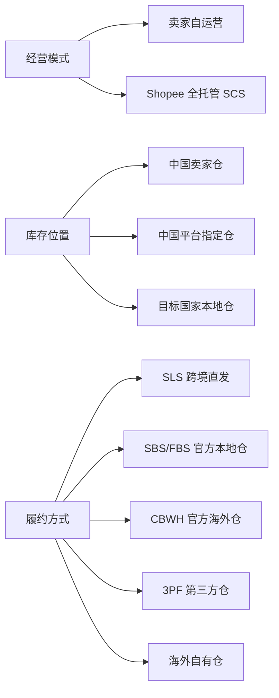
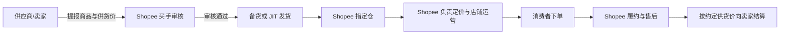
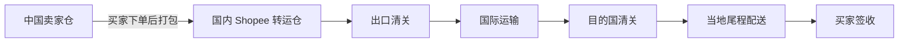
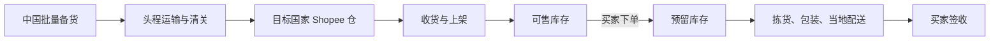
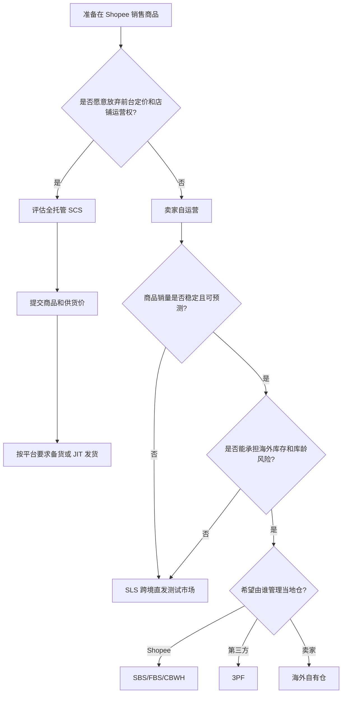

# Shopee 跨境业务视角

> 文档日期：2026-08-29
> 适用对象：业务负责人、供应链负责人、跨境运营、财务、管理层
> 目标：统一 Shopee 自运营、全托管、跨境直发、本地仓、SBS/FBS 等概念，明确不同模式下货、单、钱分别由谁负责。

## 1. 先用三个维度理解 Shopee 跨境业务

Shopee 的业务模式不能只用一个名称判断，应拆成三个维度：

| 维度 | 回答的问题 | 常见选项 |
| --- | --- | --- |
| 经营权 | 谁负责商品、价格、营销和店铺运营？ | 卖家自运营、Shopee 全托管 |
| 库存位置 | 买家下单前，货在哪里？ | 中国卖家仓、中国平台仓、目标国家本地仓 |
| 履约责任 | 谁负责出库、跨境运输和尾程配送？ | SLS、SBS/FBS、CBWH、NNWH、3PF、自有海外仓 |



## 2. 经营模式

### 2.1 卖家自运营

卖家拥有主要经营权：

- 自己选择商品和 SKU。
- 自己决定售价、折扣和利润空间。
- 自己负责商品内容、营销、广告和库存计划。
- 自己处理订单运营和主要售后责任。
- 可选择 SLS 跨境直发，也可选择当地仓履约。

这是普通 Shopee 跨境店铺最常见的模式。

### 2.2 Shopee 全托管 SCS

全托管模式下，卖家更接近供应商：

- 卖家负责产品开发、选品配合、供货、备货和质量。
- Shopee 负责前台定价、商品运营、流量、活动、物流和售后。
- 卖家通常按与平台确认的供货价结算。
- 前台售价不等于卖家结算价。
- 业务一般在 Shopee 全托管供应商体系中运行，不等同于普通店铺 Open API。



### 2.3 “半托管”在 Shopee 中怎么理解

当前公开的 Shopee 中文官方资料中，“半托管”不是一个像全托管 SCS 那样统一、稳定的标准产品名称。

行业中常说的 Shopee 半托管，通常对应以下业务组合：

```text
卖家自己运营商品和价格
+ 卖家提前备货到海外
+ 当地仓负责出库
+ Shopee负责平台交易及当地配送
```

Shopee 官方更常使用这些名称：

- 本地化履约
- 官方海外仓
- FBS/SBS
- 3PF
- PFF
- 海外自有仓发货

因此，业务讨论中可以用“类似半托管”帮助理解，但系统字段和合同中应使用 Shopee 的正式渠道名称。

## 3. 履约模式

### 3.1 SLS 跨境直发

货物在买家下单前仍位于中国：



适合：

- 新品测试。
- 长尾 SKU。
- 销量不稳定、不适合提前压海外库存的商品。
- 体积和重量适合跨境小包的商品。

主要风险：

- 配送周期相对较长。
- 单件跨境物流成本较高。
- 受发货时效 DTS、清关和航空限制影响。

### 3.2 SBS/FBS、CBWH 官方本地仓

卖家提前将商品批量运入目标国家的 Shopee 仓库，订单产生后在当地出库。



适合：

- 稳定热销 SKU。
- 需要提升配送时效和转化率的商品。
- 单件跨境直发成本较高、适合批量头程的商品。
- 大促期间需要快速履约的商品。

主要风险：

- 需要提前采购和备货，占用现金流。
- 存在滞销、库龄和仓储费用。
- 需要准确管理补货周期、在途和可售库存。

### 3.3 3PF 与海外自有仓

商品同样提前位于目标国家，但仓库不是 Shopee 自营仓：

- `3PF`：Shopee 合作或认可的第三方履约仓。
- 海外自有仓：卖家自己租赁、建设或直接管理的当地仓库。

卖家对仓储合同、库存准确性、出库 SLA 和异常处理承担更多责任，但通常也获得更强的库存调度能力。

### 3.4 NNWH 中国平台仓

`NNWH` 通常指 Shopee 南宁仓。商品提前备入中国境内的平台仓，再由平台组织后续跨境履约。

它与目标国家本地仓的关键区别是：买家下单前，商品还没有进入销售国家。

## 4. “本地仓”和“跨境仓”的区别

### 4.1 本地仓

本地仓是物理概念：仓库位于销售目标国家，例如菲律宾仓。

本地仓可以是：

- Shopee 官方仓 SBS/FBS/CBWH
- 第三方仓 3PF
- 卖家自有海外仓

使用本地仓不代表店铺一定是“菲律宾本土店”。中国跨境卖家也可以通过本地化履约项目使用菲律宾仓。

### 4.2 跨境仓

“跨境仓”在实际沟通中存在歧义：

1. 有人用它表示中国境内用于跨境发货的仓库。
2. 有人用它表示 `CBWH（Cross Border Warehouse）`。

需要特别注意：Shopee 官方将 CBWH 归类为“Shopee 海外仓”。虽然名称含 Cross Border，但通常是服务跨境卖家的目标市场仓库，不应仅凭名称判断仓库在中国。

系统中不要只保存“本地仓/跨境仓”两个模糊值，建议至少记录：

| 字段 | 示例 |
| --- | --- |
| `seller_type` | `CROSS_BORDER`、`LOCAL` |
| `operation_mode` | `SELF_OPERATED`、`FULLY_MANAGED` |
| `fulfillment_mode` | `SLS`、`SBS_FBS`、`CBWH`、`NNWH`、`3PF`、`OWN_WAREHOUSE` |
| `warehouse_country` | `CN`、`PH` |
| `warehouse_owner` | `SHOPEE`、`THIRD_PARTY`、`SELLER` |

## 5. 经营模式责任对照

| 事项 | 自运营 + SLS | 自运营 + 当地仓 | Shopee 全托管 |
| --- | --- | --- | --- |
| 商品开发 | 卖家 | 卖家 | 卖家 |
| 前台定价 | 卖家 | 卖家 | Shopee |
| 商品运营 | 卖家 | 卖家 | Shopee |
| 广告营销 | 卖家为主 | 卖家为主 | Shopee 为主 |
| 出单前库存 | 中国卖家仓 | 目标国家仓 | 指定仓/JIT，按项目规则 |
| 订单打包 | 卖家 | 当地仓 | Shopee/指定仓 |
| 国际运输 | 出单后逐单发生 | 入仓前批量发生 | Shopee 方案 |
| 当地尾程 | Shopee/合作物流 | Shopee/合作物流 | Shopee |
| 售后 | 卖家与平台规则共同承担 | 卖家与平台规则共同承担 | Shopee 为主 |
| 结算基础 | 前台订单收入扣费 | 前台订单收入扣费 | 约定供货价 |

## 6. 业务模式选择流程图



## 7. 关键经营指标

### 7.1 跨境直发关注

- DTS 发货时效
- 到转运仓扫描时效
- 国际运输时效
- 单件跨境物流成本
- 取消率和迟发货率

### 7.2 本地仓关注

- `sellable_qty`：可售库存
- `reserved_qty`：预留库存
- `unsellable_qty`：不可售库存
- `in_transit_pending_putaway_qty`：在途待上架库存
- `selling_speed`：销售速度
- `coverage_days`：库存覆盖天数
- 库龄和仓储费用
- 缺货率和补货及时率

### 7.3 全托管关注

- 选品通过率
- 核价通过率
- 备货单及时交付率
- 质检合格率
- 供货结算金额
- 滞销和退供风险

## 8. 当前 BAGSMART 接入属于哪种业务

当前已经验证的业务组合是：

```text
中国跨境卖家
+ BAGSMART Global Store 菲律宾站
+ 卖家自运营
+ Shopee 菲律宾本地仓履约
+ SBS/FBS 库存管理
```

判断依据：

- 店铺接口返回地区 `PH`。
- SBS 绑定仓接口返回菲律宾仓库编码。
- 当前库存接口返回可售、预留、不可售、在途和销售周转数据。
- 数据通过普通店铺 `shop_id + access_token` 授权访问。

因此，它不是 Shopee 全托管 SCS 供应商业务，也不是 SLS 中国逐单直发库存。

## 9. 官方参考

- [Shopee 全托管服务专区](https://service.shopeecb.cn/scs-zone)
- [Shopee 官方入驻通道：跨境直发与海外本土发货](https://shopee.cn/s/16GPPYju)
- [Shopee 多履约渠道利润计算器](https://solutions.shopee.cn/sellers/lff-cost-calculator/)
- [Shopee SBS / Service by Shopee 介绍](https://shopee.kr/blog/detail.php?seq=342)
- [Shopee FBS / 当地履约服务介绍](https://shopee.kr/solution/warehouse.php)
- [Shopee SLS 物流服务](https://shopee.kr/solution/sls.php)

## 10. 相关文档

- [Shopee 跨境产品视角](./Shopee跨境产品视角.md)
- [Shopee 跨境开发视角](./Shopee跨境开发视角.md)
- [Shopee SBS 库存接口接入与排障记录](../Shopee-SBS库存接口接入与排障记录.md)
