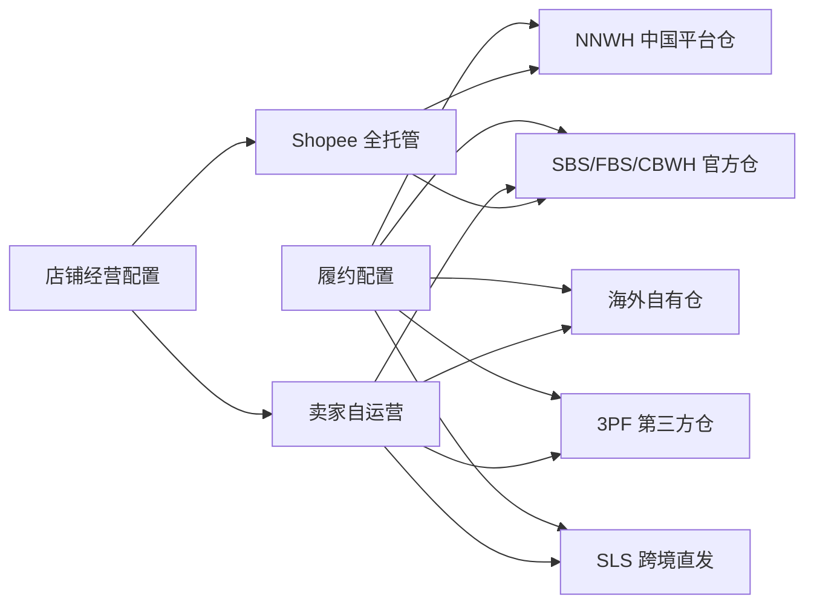
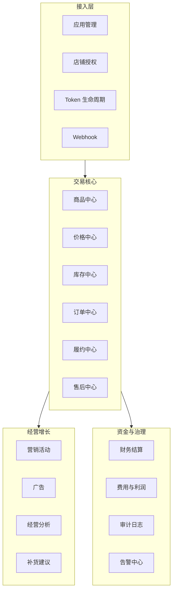
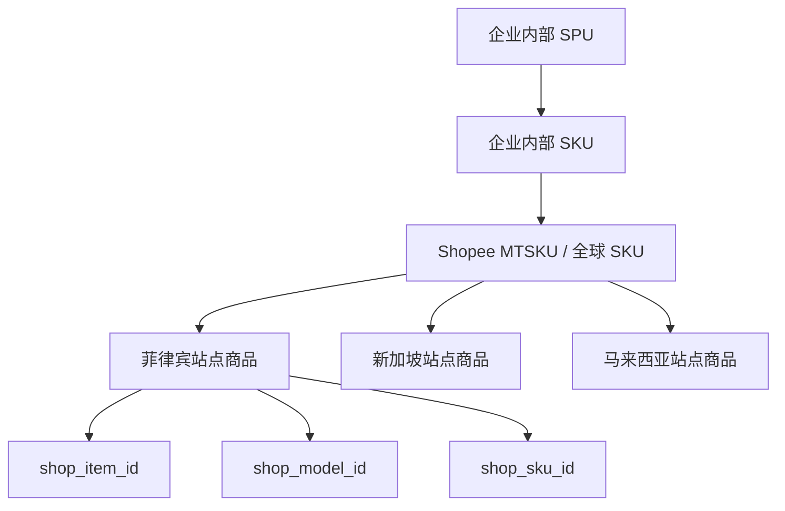
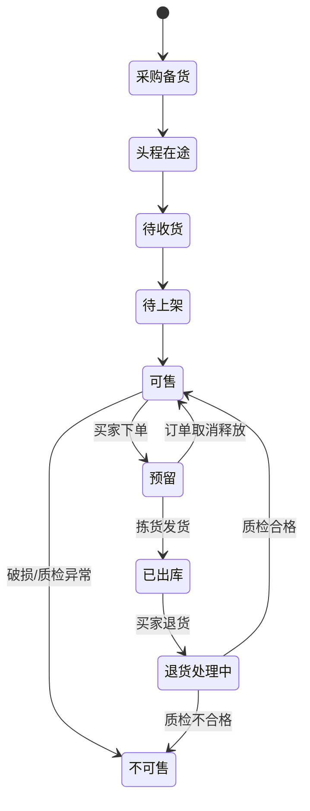
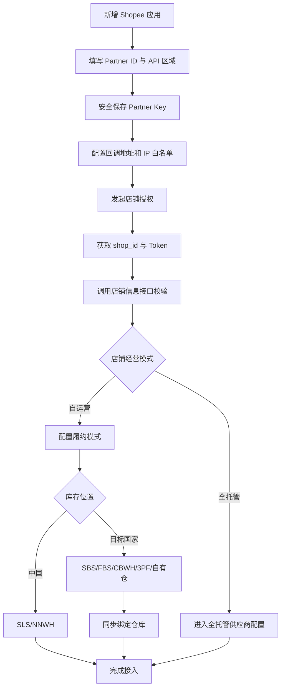
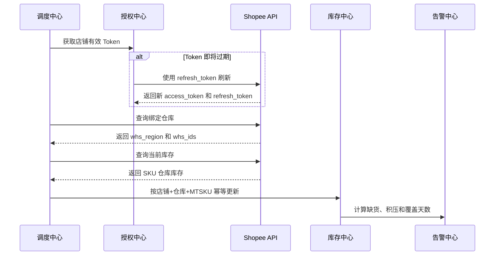

# Shopee 跨境产品视角

> 文档日期：2026-08-29
> 适用对象：产品经理、业务分析师、项目经理、运营产品负责人
> 目标：将 Shopee 跨境业务转化为可配置、可扩展、可审计的产品能力，而不是为单一店铺堆叠接口。

## 1. 产品定位

本项目可以逐步建设为一个 Shopee 跨境经营中台，统一管理：

- 多应用授权
- 多商户和多店铺
- 全球商品与站点商品
- 多 SKU 和商品映射
- 多履约渠道
- 多仓库存
- 订单、物流和售后
- 营销、财务和经营分析

产品设计必须区分“经营模式”和“履约模式”：

经营模式和履约模式应允许组合，不应使用一个 `shop_type` 字段承载所有含义。

## 2. 用户角色

| 角色 | 核心诉求 |
| --- | --- |
| 系统管理员 | 配置应用、权限、回调地址、IP 白名单和操作人员 |
| 店铺运营 | 管理商品、价格、活动、订单和店铺状态 |
| 商品人员 | 管理全球商品、站点商品、SKU、图片和类目属性 |
| 供应链人员 | 管理采购、备货、在途、补货和库存覆盖天数 |
| 仓库人员 | 管理入库、出库、可售、预留、残次和库存调整 |
| 物流人员 | 管理发货、面单、揽收、跨境运输和尾程轨迹 |
| 售后人员 | 管理取消、退货、退款、争议和逆向物流 |
| 财务人员 | 管理回款、平台费用、物流费、仓储费和利润 |
| 管理层 | 查看销售、库存周转、利润、履约质量和经营风险 |

## 3. 产品能力地图

## 4. 核心产品模块

### 4.1 应用与授权中心

管理对象：

- Shopee Open Platform 应用
- `partner_id`
- API 区域域名
- 授权回调地址
- 商户、主账号和店铺
- `access_token` 与 `refresh_token`
- Token 到期时间和刷新状态
- API 权限和调用状态

关键产品要求：

- 密钥只允许受控角色查看。
- Token 自动刷新并保留轮换记录。
- 一个应用可以关联多个店铺。
- 店铺切换时必须校验 Token 与 `shop_id` 的绑定关系。
- 授权失败、IP 白名单失败和 Token 失效应有明确提示。

### 4.2 店铺中心

建议记录：

| 字段 | 说明 |
| --- | --- |
| 店铺名称 | Shopee 返回的店铺名称 |
| `shop_id` | Shopee 店铺 ID |
| 站点 | PH、SG、MY 等 |
| 卖家类型 | 跨境卖家、本地卖家 |
| 经营模式 | 自运营、全托管 |
| 履约模式 | SLS、SBS/FBS、CBWH、NNWH、3PF、自有仓 |
| 店铺状态 | NORMAL、冻结、关闭等 |
| 授权状态 | 正常、即将过期、失效 |

### 4.3 商品中心

商品需要分层：

核心功能：

- 全球商品与站点商品映射
- 类目、属性、品牌和规格
- 商品图片、视频和描述
- 商品发布、修改、上下架
- 多站点价格换算
- 内部 SKU、MTSKU、Shop SKU 映射
- 条码管理

注意：SBS 当前库存接口返回 `mtsku_id` 和 `shop_sku_id`，但不返回条码。条码应由内部商品主数据维护。

### 4.4 库存中心

库存不能只保存一个数字，应区分库存层次：

| 库存类型 | 示例字段 |
| --- | --- |
| 企业实际库存 | ERP/WMS 实物库存 |
| 平台普通商品库存 | Shopee 商品可售数量 |
| SBS/FBS 可售库存 | `sellable_qty` |
| 预留库存 | `reserved_qty` |
| 不可售库存 | `unsellable_qty` |
| 在途待上架 | `in_transit_pending_putaway_qty` |
| 仓库维度库存 | `whs_id` |
| 库存周转 | 销量、销售速度、覆盖天数、库龄 |

### 4.5 订单中心

核心能力：

- 增量拉取与全量补偿
- 订单详情和商品明细
- 地址、支付、金额和优惠拆分
- 订单状态标准化
- 取消和异常订单
- 多包裹和拆单
- 订单幂等处理
- 原始响应留档

### 4.6 履约中心

根据履约模式展示不同工作台：

| 模式 | 产品重点 |
| --- | --- |
| SLS | 出货时限、面单、首公里、转运仓扫描、国际轨迹 |
| SBS/FBS | 入库、仓库库存、补货、库存流水、库龄、效期 |
| 3PF | 第三方仓指令、出库回传、库存对账、SLA |
| 自有仓 | WMS 波次、拣配、尾程面单、库存同步 |
| 全托管 | 商品提报、核价、备货单、JIT、质检、供货结算 |

### 4.7 售后中心

- 取消订单
- 退货退款
- 争议处理
- 举证材料
- 逆向物流
- 退货商品质检
- 可售/不可售库存回补

### 4.8 财务中心

- 订单收入
- 佣金
- 交易手续费
- 活动服务费
- 跨境物流费
- 仓储费和操作费
- 广告费
- 退款和赔偿
- 汇率
- 商品毛利和订单净利润
- 全托管供货价结算

## 5. 店铺接入配置流程

## 6. 库存同步产品流程

## 7. 页面与功能建议

### 7.1 第一阶段：接入可用

- Shopee 应用配置页
- 店铺授权页
- Token 状态页
- 店铺信息页
- 绑定仓库页
- 当前库存查询页
- 原始 JSON 查看和下载

### 7.2 第二阶段：业务可运营

- 多店铺库存总览
- SKU 映射管理
- 在途、可售、预留和不可售库存
- 低库存与断货告警
- 补货建议
- 库龄和滞销分析
- 库存差异对账

### 7.3 第三阶段：经营闭环

- 商品发布和多站点铺货
- 订单自动同步
- 自动发货和面单
- 售后和逆向物流
- 财务费用及利润
- 营销和广告效果
- 管理驾驶舱

## 8. 当前已完成和未完成

### 已完成

- 本地安全配置 Shopee 应用和店铺凭证
- 店铺 Token 刷新并自动回写
- 店铺授权有效性验证
- SBS 绑定仓库验证
- SBS 当前库存查询
- MTSKU 匹配
- 仓库库存明细输出
- 完整响应 JSON 留档

### 尚未产品化

- 当前测试仍固定查询一个 Item ID 和 MTSKU
- 尚无管理页面
- 尚无数据库库存快照
- 尚无定时同步任务
- 尚无库存差异和补货告警
- 尚未接入订单、物流、售后和财务闭环
- 尚未接入 Shopee 全托管 SCS 供应商流程

## 9. 产品设计原则

1. 不把自运营、全托管、SLS、SBS 全塞进一个店铺类型字段。
2. 原始平台数据与内部标准数据同时保留。
3. Token、店铺、仓库和 SKU 都必须有明确绑定关系。
4. 库存按店铺、站点、仓库、MTSKU 和时间建立快照。
5. 所有同步任务必须幂等、可重试、可追踪。
6. 业务错误要翻译为用户能理解的操作建议。
7. 不同市场的权限、字段和规则必须配置化。

## 10. 相关文档

- [Shopee 跨境业务视角](./Shopee跨境业务视角.md)
- [Shopee 跨境开发视角](./Shopee跨境开发视角.md)
- [Shopee SBS 接口接入与排障记录](../Shopee-SBS库存接口接入与排障记录.md)
