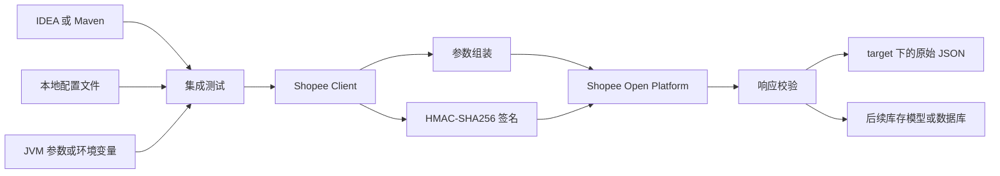
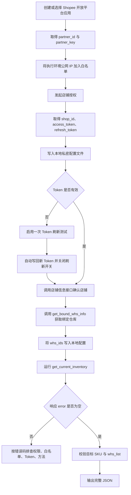
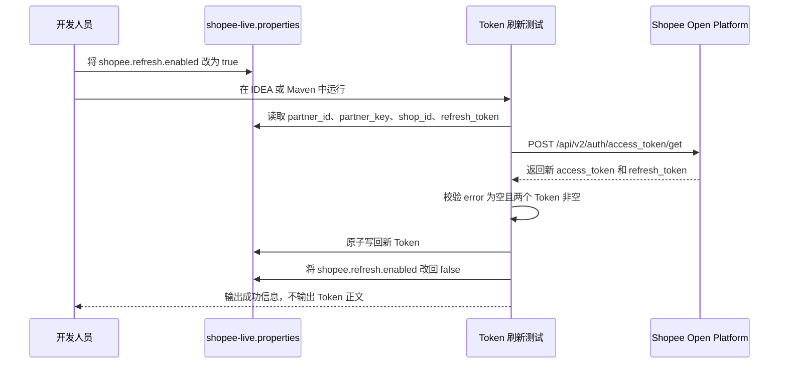
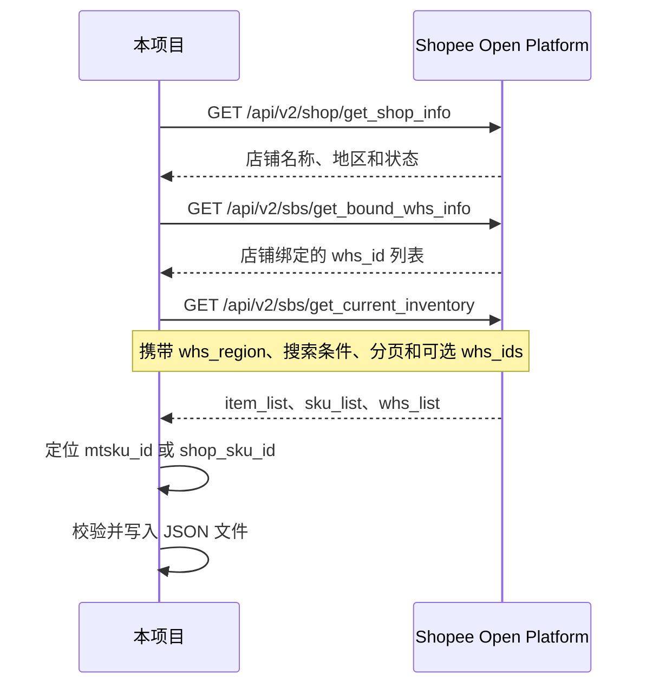
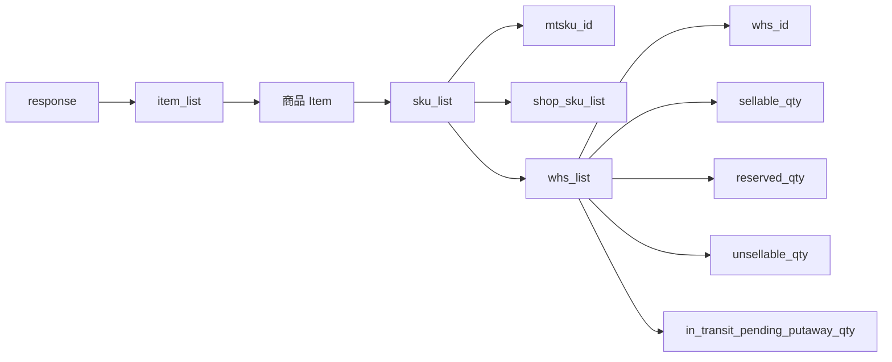
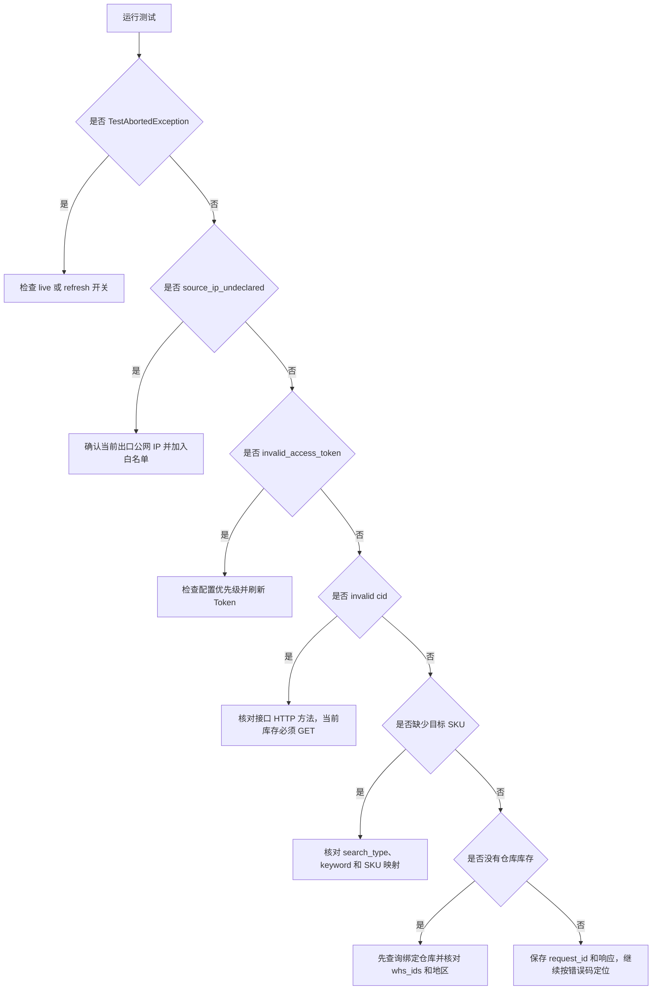
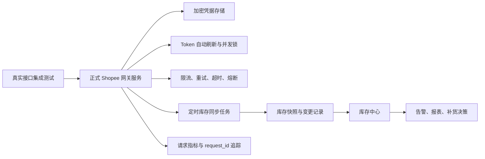

# Shopee 跨境开发视角

> 文档日期：2026-08-29
> 适用对象：后端开发、测试、运维、技术负责人
> 当前范围：Shopee 店铺授权、Token 刷新、SBS 仓库查询与当前库存查询

## 1. 开发目标

当前阶段不是建设完整的 Shopee ERP，而是先验证一条最小可用链路：

1. 使用 Shopee 开放平台应用身份完成签名。
2. 使用已授权店铺的 `shop_id` 和 Token 调用店铺级接口。
3. 查询店铺绑定的 SBS 仓库。
4. 按商品或 SKU 查询各仓库存。
5. 把原始响应写入 JSON 文件，便于核对和后续建模。

本次已实测通过的店铺为 `BAGSMART Global Store-PH`。测试代码中包含样例商品标识，但本文不记录任何真实密钥或 Token。

## 2. 当前代码与文件

| 用途 | 文件 | 是否提交 Git |
| --- | --- | --- |
| 刷新店铺 Token | `src/test/java/com/eshop/util/platform/api/service/auth/shopee/ShopeeRefreshTokenIntegrationTest.java` | 是 |
| 查询当前库存 | `src/test/java/com/eshop/util/platform/api/service/sbs/shopee/ShopeeGetCurrentInventoryIntegrationTest.java` | 是 |
| 本地真实配置 | `src/test/resources/shopee-live.properties` | 否，已忽略 |
| 每次运行生成的响应 | `target/shopee-current-inventory-response.json` | 否，随 `target` 忽略 |
| 脱敏或确认可公开的响应样例 | `docs/shopee-current-inventory-response.json` | 是 |
| 本次接口排障记录 | `docs/Shopee-SBS库存接口接入与排障记录.md` | 是 |

当前两个 Java 类都是“真实接口集成测试”，会访问 Shopee 线上环境，不是无网络的单元测试。

## 3. 技术架构



配置优先级从高到低为：

```text
JVM 系统属性 > 操作系统环境变量 > shopee-live.properties > 代码默认值
```

因此临时调试可以用 `-D` 参数覆盖本地文件，不需要反复修改文件。

## 4. 开放平台前置配置

### 4.1 必备数据

| 配置 | 来源 | 用途 |
| --- | --- | --- |
| `partner_id` | Shopee 开放平台应用 | 标识开发者应用 |
| `partner_key` | Shopee 开放平台应用 | 生成 HMAC-SHA256 签名 |
| `shop_id` | 店铺授权结果 | 标识具体店铺 |
| `access_token` | 授权或刷新结果 | 调用店铺级业务接口 |
| `refresh_token` | 授权或刷新结果 | 换取新的 Token |
| API 地址 | 中国跨境开放平台 | 当前使用 `https://openplatform.shopee.cn` |
| 出口公网 IP | 当前执行机器或服务器 | 配置 API IP 白名单 |
| SBS 仓库 ID | `get_bound_whs_info` | 限定库存查询仓库范围 |

仅有店铺名称、仓库 SKU ID 或条码不能调用接口。至少还需要应用身份、店铺授权、有效 Token 和白名单网络环境。

### 4.2 完整配置流程图



### 4.3 本地配置文件

在 `src/test/resources/shopee-live.properties` 中配置，示例如下：

```properties
# 是否允许执行实时库存测试
shopee.live.enabled=true

# 仅在需要刷新 Token 时临时改为 true；成功后测试会自动改回 false
shopee.refresh.enabled=false

shopee.partner-id=填写PartnerID
shopee.partner-key=填写PartnerKey
shopee.shop-id=填写ShopID
shopee.access-token=填写AccessToken
shopee.refresh-token=填写RefreshToken

shopee.api-url=https://openplatform.shopee.cn
shopee.whs-ids=填写店铺绑定的仓库ID列表
shopee.inventory-output-file=target/shopee-current-inventory-response.json
```

注意：

- 此文件包含长期密钥和店铺 Token，必须保持 Git 忽略状态。
- `shopee.live.enabled=false` 时，库存测试会显示 `TestAbortedException`。这是主动跳过，不是接口失败。
- `shopee.refresh.enabled` 默认应为 `false`，避免运行全部测试时意外刷新并轮换 Token。
- 切换店铺时，至少同时更换 `shop-id`、`access-token`、`refresh-token` 和该店铺的 `whs-ids`。

## 5. 鉴权和签名

Shopee V2 接口使用当前时间戳和应用密钥生成 HMAC-SHA256 签名。不同接口的签名原文不同。

### 5.1 公共级接口

```text
base_string = partner_id + api_path + timestamp
sign = HMAC-SHA256(partner_key, base_string)
```

### 5.2 店铺级接口

```text
base_string = partner_id + api_path + timestamp + access_token + shop_id
sign = HMAC-SHA256(partner_key, base_string)
```

店铺级请求通常需要在查询参数中携带：

- `partner_id`
- `timestamp`
- `sign`
- `access_token`
- `shop_id`

签名排查时应检查：API 路径是否完全一致、时间戳是否为当前 Unix 秒、服务器时间是否准确、Token 与 `shop_id` 是否属于同一次店铺授权。

## 6. Token 刷新流程

刷新接口由现有 `ShopeeAuthCallServiceImpl` 封装，测试负责读取本地配置、调用接口和安全写回。



为什么要同时写回两个 Token：Shopee 刷新后可能轮换 `refresh_token`，继续保存旧值会导致下一次刷新失败。

如果刷新失败，测试不会覆盖本地文件，先根据响应中的 `error`、`message` 和 `request_id` 排查。

## 7. SBS 库存接口调用链

### 7.1 建议调用顺序



### 7.2 当前库存请求参数

当前测试使用：

| 参数 | 当前含义 |
| --- | --- |
| `whs_region` | 仓库国家或地区，当前为 `PH` |
| `search_type` | 搜索类型，当前测试以 Item ID 查询 |
| `keyword` | 与 `search_type` 对应的查询值 |
| `page_no` | 页码，从 1 开始 |
| `page_size` | 每页数量，当前为 100 |
| `whs_ids` | 可选，店铺绑定的仓库 ID 列表 |

### 7.3 必须使用 GET

本项目真实环境已经验证：

- 使用 POST 调用 `/api/v2/sbs/get_current_inventory` 时，网关持续返回 `block by gateway due to invalid cid`。
- 按官方接口定义改为 GET 后成功返回库存。
- 在当前客户端中必须设置 `request.setMediaType(1)`，并通过 `request.setMapParams(...)` 将业务参数放入查询字符串。

因此不要仅根据旧客户端的通用写法猜测 HTTP 方法，必须以具体 API 文档为准。

## 8. 响应结构和字段映射

库存响应的主要层级为：



字段使用建议：

| Shopee 字段 | 系统含义 | 建议用途 |
| --- | --- | --- |
| `mtsku_id` | 仓库 SKU 或 MTSKU 标识 | SBS 库存主匹配键之一 |
| `shop_sku_id` | 店铺侧 SKU 标识 | 关联店铺商品 SKU |
| `whs_id` | Shopee 仓库标识 | 库存维度键 |
| `sellable_qty` | 可售库存 | 前台可销售量或库存决策输入 |
| `reserved_qty` | 预占库存 | 已占用但尚未完成出库的数量 |
| `unsellable_qty` | 不可售库存 | 质检异常、破损等库存分析 |
| `in_transit_pending_putaway_qty` | 在途待上架库存 | 补货和到仓预测输入 |

条码是企业内部商品映射字段。本次 `get_current_inventory` 响应没有返回条码，不能直接用条码在响应中断言；应在系统内维护：

```text
内部条码 <-> 本地 SKU <-> Shopee shop_sku_id <-> Shopee mtsku_id
```

## 9. IDEA 与 Maven 执行

### 9.1 IDEA

库存查询：

1. 确认 `shopee.live.enabled=true`。
2. 打开 `ShopeeGetCurrentInventoryIntegrationTest`。
3. 运行 `shouldGetCurrentInventoryForBagsmartGlobalStorePh`。
4. 查看控制台断言结果和 `target/shopee-current-inventory-response.json`。

Token 刷新：

1. 将 `shopee.refresh.enabled=true`。
2. 打开 `ShopeeRefreshTokenIntegrationTest`。
3. 运行 `shouldRefreshShopTokenAndUpdateLocalConfig`。
4. 成功后确认配置中的两个 Token 已更新，刷新开关已自动恢复为 `false`。

### 9.2 Maven

PowerShell 中建议给带点号的 `-D` 参数加引号：

```powershell
mvn --no-transfer-progress "-Djavacpp.platform=windows-x86_64" "-Dtest=ShopeeGetCurrentInventoryIntegrationTest" test
```

```powershell
mvn --no-transfer-progress "-Djavacpp.platform=windows-x86_64" "-Dtest=ShopeeRefreshTokenIntegrationTest" test
```

## 10. 错误排查流程



常见现象对照：

| 现象 | 含义 | 处理 |
| --- | --- | --- |
| `TestAbortedException: Assumption failed` | 实时测试开关未开启 | 在本地配置开启对应开关 |
| `source_ip_undeclared` | Shopee 未放行当前公网 IP | 获取真实出口 IP并加入应用白名单 |
| `invalid_access_token` | Token 过期、错误或被其他配置覆盖 | 检查配置优先级，必要时刷新 |
| `block by gateway due to invalid cid` | 请求未按接口定义通过网关 | 当前库存接口改用 GET，并检查路径 |
| 接口成功但找不到 SKU | 搜索条件或标识映射错误 | 区分 Item ID、MTSKU、店铺 SKU 和条码 |
| `whs_list` 为空 | 仓库范围、地区或实际库存不匹配 | 先获取绑定仓库，再检查 `whs_ids` |

## 11. 安全要求

1. 不得把 `partner_key`、`access_token`、`refresh_token` 写入 Java、Markdown、JSON 样例或 Git 历史。
2. 不得在普通日志中打印完整请求 URL，因为查询参数可能包含 `access_token` 和签名。
3. 本地私密配置必须通过 `.gitignore` 排除；提交前执行敏感信息扫描。
4. `target` 下原始响应默认不提交；要提交到 `docs` 时先检查是否包含店铺隐私或业务敏感数据。
5. 已经在聊天、工单或 Git 中暴露过的 Token 和密钥应立即轮换，删除文本并不能让已泄露凭据重新安全。
6. 生产环境不得继续使用明文测试配置，应使用密钥管理服务或加密配置中心。

## 12. 从测试演进到生产

当前实现证明接口可用，但生产化还需补齐：



生产设计建议：

- 凭据按 `partner_id + shop_id` 隔离存储。
- Token 刷新使用分布式锁，防止多个节点同时刷新导致互相覆盖。
- 401、Token 失效和限流重试应区分处理，不要对所有错误无脑重试。
- 库存同步以 `shop_id + mtsku_id + whs_id` 建议作为业务唯一维度。
- 保存原始响应摘要和 Shopee `request_id`，方便对账与技术支持定位。
- 分页拉取必须完整遍历，并监控单店单次拉取耗时和缺失率。
- 明确库存字段口径，避免把可售、预占、在途相加后直接发布为可售库存。

## 13. 开发验收清单

- [ ] 开放平台应用可用，Partner 信息正确。
- [ ] 当前执行环境公网 IP 已加入白名单。
- [ ] 店铺已完成授权，`shop_id` 与 Token 属于同一店铺。
- [ ] 本地私密配置未被 Git 跟踪。
- [ ] Token 刷新成功后新旧 Token 已正确轮换。
- [ ] 店铺信息接口返回预期店铺和地区。
- [ ] 已取得该店铺绑定的 SBS 仓库 ID。
- [ ] 当前库存接口使用 GET。
- [ ] 目标 MTSKU 或店铺 SKU 能在响应中定位。
- [ ] `whs_list` 至少返回一个仓库库存记录。
- [ ] 完整响应已写入预期 JSON 文件。
- [ ] 日志、文档和提交内容不包含密钥或 Token。

## 14. 相关文档

- [Shopee 跨境业务视角](./Shopee跨境业务视角.md)
- [Shopee 跨境产品视角](./Shopee跨境产品视角.md)
- [Shopee SBS 库存接口接入与排障记录](../Shopee-SBS库存接口接入与排障记录.md)
- [Shopee 当前库存响应样例](../shopee-current-inventory-response.json)
- [Shopee get_current_inventory 官方文档](https://open.shopee.com/documents/v2/v2.sbs.get_current_inventory?module=124&type=1)
